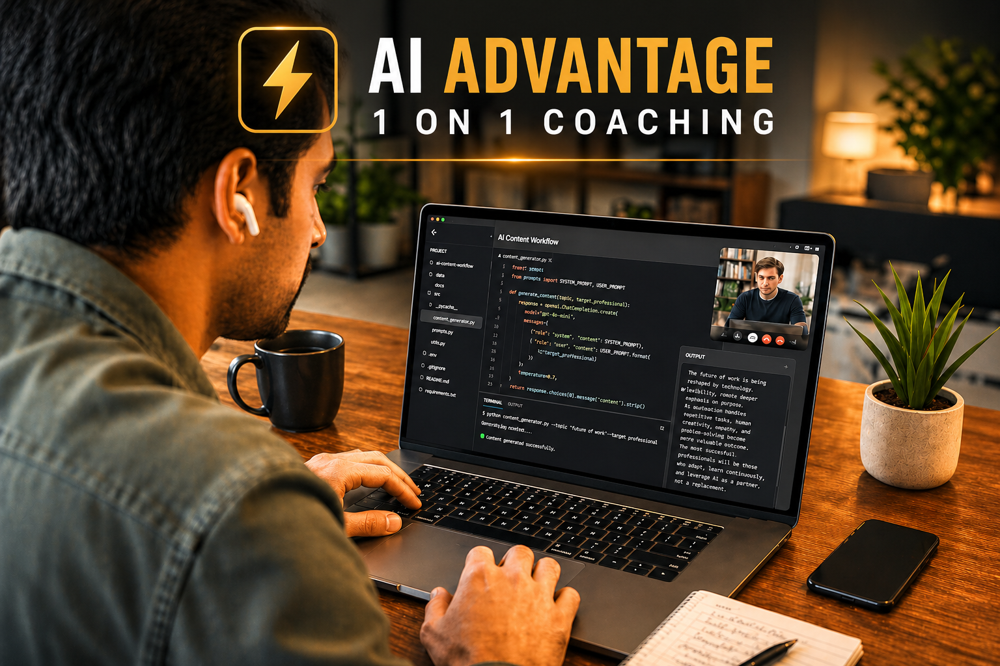
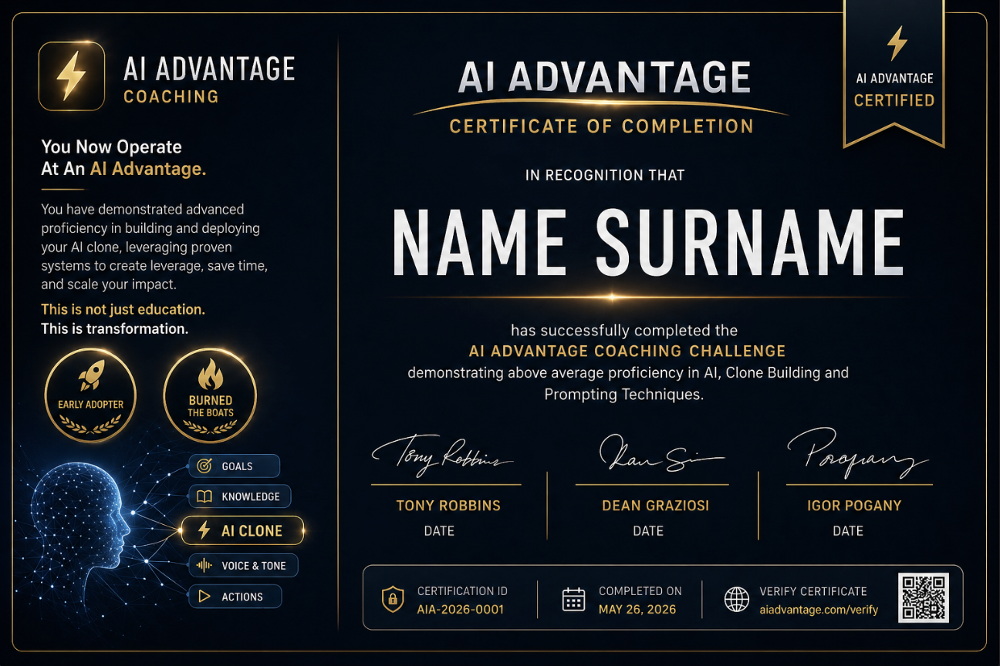
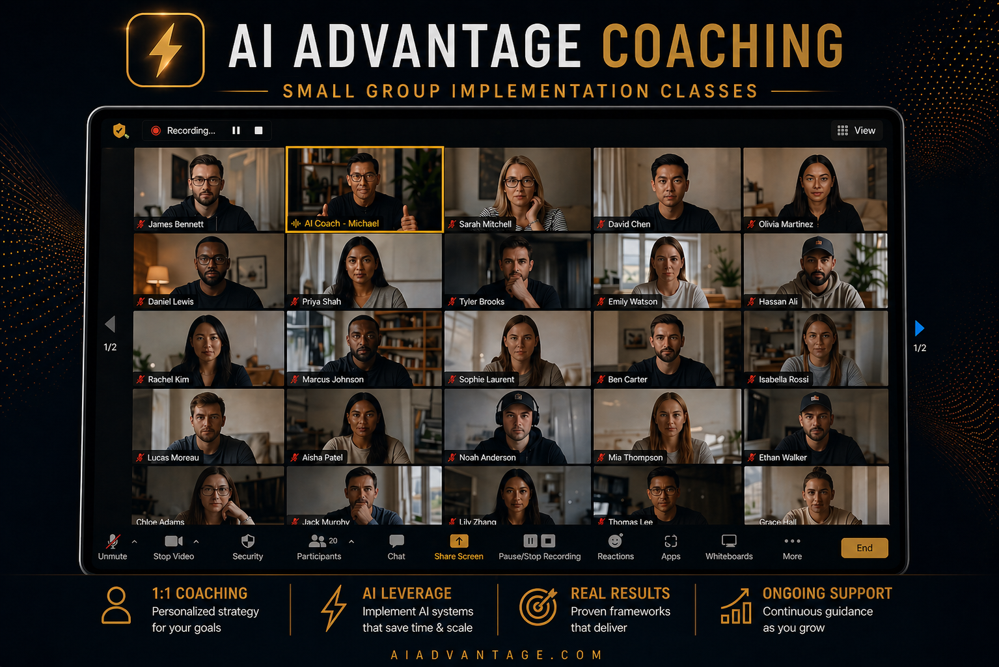

[index.html](https://github.com/user-attachments/files/27267199/index.html)
<!doctype html>
<html lang="en">
<head>
  <meta charset="utf-8" />
  <meta name="viewport" content="width=device-width, initial-scale=1" />
  <title>AI Advantage — 1 on 1 Coaching Enrollment</title>
  <meta name="description" content="Premium AI Advantage 1 on 1 Coaching order form mockup." />
  <link rel="preconnect" href="https://fonts.googleapis.com">
  <link rel="preconnect" href="https://fonts.gstatic.com" crossorigin>
  <link href="https://fonts.googleapis.com/css2?family=Inter:wght@400;500;600;700;800&family=Playfair+Display:wght@600;700&display=swap" rel="stylesheet">
  
</head>
<body>
  <header class="nav">
    

      
AI Advantage

      <nav class="navlinks"><a href="#experience">Experience</a><a href="#bonuses">Bonuses</a><a href="#plans">Payment Plans</a><a class="btn ghost" href="#checkout">Enroll Now</a></nav>
    

  </header>

  <main>
    <section class="hero">
      

        

          
Founding Member Invitation

          <h1>AI Advantage 1 on 1 Coaching</h1>
          
A premium coaching experience designed to help you fully implement your AI Clone, sharpen your strategy, and turn AI into a practical advantage in your business, productivity, and life.

          

            
✓ Private AI Advantage Coach

            
✓ Clone implementation support

            
✓ Premium bonuses included

            
✓ Secure enrollment

          

          <a class="btn" href="#checkout">Reserve My Coaching Seat</a>
        

        

          
          
<strong>Top Tier Proven Coaching</strong>
Personalized support to help you move from inspiration to implementation.

        

      

    </section>

    <section id="experience" class="section">
      

        
<h2>The Coaching Experience</h2>
Every element is designed to help you translate the AI Advantage system into a real working advantage.

        

          <article class="offer">
Core Program<h3>One-on-One AI Advantage Coaching Sessions</h3>
Work privately with an AI Advantage Certified Coach to implement your AI Clone, refine your workflows, and build systems you can actually use.
<ul class="checks"><li>Personalized coaching and accountability</li><li>Clone integration and prompt refinement</li><li>Implementation-focused sessions</li></ul>
</article>
          <article class="offer">
Credential<h3>AI Advantage Certificate of Completion</h3>
Earn an official certificate recognizing your completion of the coaching journey and your demonstrated proficiency with AI Clone usage, prompting, and implementation.
<ul class="checks"><li>Completion recognition</li><li>AI adoption milestone</li><li>Proof you built the skill</li></ul>
</article>
        

      

    </section>

    <section id="bonuses" class="section">
      

        
<h2>Founding Member Bonuses</h2>
Additional experiences and tools designed to deepen your implementation and extend your momentum beyond the private sessions.

        

          <article class="offer">
<b>6 AI Workshops Placeholder</b>

Bonus Placeholder<h3>Six Advanced AI Workshop Experiences</h3>
Placeholder copy for the workshop bonus. This area can be updated once the final workshop positioning, titles, and imagery are approved.
<ul class="checks"><li>Monthly advanced implementation</li><li>Build alongside expert guidance</li><li>Train your Clone around each system</li></ul>
</article>
          <article class="offer">
<b>Deep Dive Installation</b>

Bonus Placeholder<h3>Deep Dive Installation Workshops</h3>
Placeholder copy for the six-workshop bonus. Use this block for the final Personal Leverage, Strategy, Time, Marketing, Sales, and Operations messaging.
<ul class="checks"><li>Install one system at a time</li><li>Turn concepts into workflows</li><li>Walk away with usable assets</li></ul>
</article>
          <article class="offer">
Bonus<h3>Small Group Implementation Classes</h3>
Join a select group of early adopters refining their AI Clones, sharing momentum, and staying accountable to real implementation.
<ul class="checks"><li>Guided implementation support</li><li>Community accountability</li><li>Continued refinement</li></ul>
</article>
          <article class="offer">
Bonus<h3>Two Tickets to a 3-Day AI Mastery Event</h3>
Attend an immersive live experience designed to deepen your skills, expand your network, and accelerate the identity shift of becoming an AI-powered leader.
<ul class="checks"><li>Two event tickets included</li><li>Live expert training</li><li>High-proximity momentum</li></ul>
</article>
          <article class="offer">
Bonus<h3>Ultimate You — Personalized Clone DNA</h3>
Your coaching conversations reveal patterns in your goals, beliefs, language, and vision. Ultimate You turns those insights into a dynamic profile that helps your Clone understand you at a deeper level.
<ul class="checks"><li>AI-analyzed coaching insights</li><li>Personalized growth patterns</li><li>Better Clone context over time</li></ul>
</article>
          <article class="offer">
Bonus<h3>Ask Igor AI Clone — 6 Months</h3>
Access Igor AI as a strategic thought partner when you need clarity, ideas, or a new angle on how to apply AI to your business and life.
<ul class="checks"><li>Six months of access</li><li>Strategic AI guidance</li><li>Faster ideation and clarity</li></ul>
</article>
        

      

    </section>

    <section id="plans" class="section">
      

        

          
<h2>Select Your Plan</h2>
Mockup pricing tokens can be replaced by your CRM/order-form variables.

          

            
Save 10%<small>@TOTPAYS@ Payment</small>
@PRICE@

Best value. Pay today and lock in your founding member seat.

            
<small>@TOTPAYS@ Payments</small>
@PRICE@

First payment due today. Remaining payment scheduled every 30 days.

            
<small>@TOTPAYS@ Payments</small>
@PRICE@

First payment due today. Remaining payments scheduled every 30 days.

            
<small>@TOTPAYS@ Payments</small>
@PRICE@

First payment due today. Remaining payments scheduled every 30 days.

          

          

          <h3>Billing Details</h3>
          <form id="orderForm">
            

              
<label for="first">First name *</label><input id="first" name="first" autocomplete="given-name" required>

              
<label for="last">Last name *</label><input id="last" name="last" autocomplete="family-name" required>

              
<label for="address">Street address *</label><input id="address" name="address" autocomplete="street-address" required>

              
<label for="city">Town / City *</label><input id="city" name="city" autocomplete="address-level2" required>

              
<label for="state">State / Province *</label><input id="state" name="state" autocomplete="address-level1" required>

              
<label for="zip">ZIP Code *</label><input id="zip" name="zip" autocomplete="postal-code" required>

              
<label for="country">Country *</label><select id="country" name="country"><option>United States</option><option>Canada</option><option>United Kingdom</option><option>Australia</option><option>New Zealand</option><option>Other</option></select>

              
<label for="phone">Phone *</label><input id="phone" name="phone" type="tel" autocomplete="tel" required>

              
<label for="email">Email address *</label><input id="email" name="email" type="email" autocomplete="email" required>

              
<label for="card">Credit Card Number *</label><input id="card" name="card" inputmode="numeric" placeholder="•••• •••• •••• ••••" required>

              
<label for="exp">Expiration Date *</label><input id="exp" name="exp" placeholder="MM / YY" required>

              
<label for="cvv">CVV *</label><input id="cvv" name="cvv" inputmode="numeric" placeholder="•••" required>

            

            

            <h3>Terms & Conditions</h3>
            

              

Section 1: I Am Committed and Able to Afford Coaching

You understand the financial commitment you are making today, agree to participate fully, attend sessions, communicate scheduling needs in advance, and keep billing information current.

              

Section 2: I Understand the Disclaimers and Waivers

The Program is for educational, informational, and personal development purposes. No guarantee of business, financial, medical, health, or specific results is made. You remain responsible for reviewing and verifying all AI-generated output before relying on it.

              

Section 3: I Will Keep Content Confidential

Program content, curriculum, coaching processes, membership areas, live events, and related materials are proprietary and may not be shared, sold, duplicated, or used to create derivative works without written permission.

              

Section 4: I Can Cancel Enrollment

You may cancel according to the stated cancellation policy. Disputes are governed by the program agreement and applicable Arizona law.

              

Section 5: I Understand the Bonuses & Inclusions

Bonuses are complimentary inclusions and do not carry separate financial value toward the program payments. Access timing may vary by program level and curriculum progress.

            

            <label class="agree"><input type="checkbox" required> Yes, I have read and agree to the Terms and Conditions and understand that this order form serves as my legal digital signature.</label>
            <button class="btn" type="submit" style="width:100%;margin-top:10px">Place Order</button>
          </form>
        

        <aside class="panel summary" aria-label="Order summary">
          <h3>Order Summary</h3>
          
AI Advantage 1 on 1 Coaching Program

          
1-on-1 Coaching SessionsIncluded

          
AI Advantage CertificateIncluded

          
Group Coaching SessionsBonus

          
6 AI WorkshopsBonus

          
2 Live Event TicketsBonus

          
Ultimate You AI Clone DNABonus

          
Igor AI AccessBonus

          
<small>Due Now</small><strong id="dueNow">@PRICE@</strong>
Pay in Full selected

          <a class="btn" href="#checkout" style="width:100%">Complete Secure Enrollment</a>
          
SSL SecureAuthorize.Net ReadyCards Accepted

          
Mockup only. Connect this layout to your CRM/payment processor before live use.

        </aside>
      

    </section>
  </main>

  
<a class="btn" href="#checkout">Enroll Now</a>

  <footer class="footer">
Copyright © AmplifyAI. All Rights Reserved.
</footer>

  
</body>
</html>
